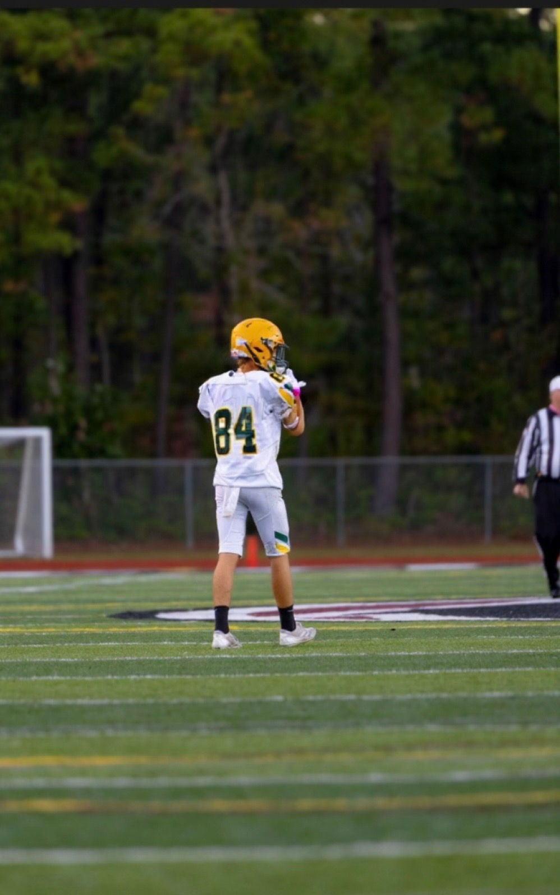

<h1 align="center">Welcome to the Friend.ly GitHub Repository!</h1>

Friend.ly is a **friendly (pun intended) community-based social media platform** inspired by the popular social media platforms Snapchat and Instagram. This repository contains the app’s s**ource code, documentation, and collaborative tools** for the development team. This README provides an **updated overview of all recent changes**, **improvements**, and **resources** related to our **project’s development workflow, roadmap, and team organization**.

---

## Availability

**Status (Updated 11/22/25)**

Friend.ly is currently in active development for **iOS**, **Android**, and **Web** platforms.  
There is no public release date at this time. We appreciate your patience as we focus on building a stable, polished experience.

---

## Platforms

Friend.ly is being developed simultaneously across three platforms, each using tools native to its environment.

- **iOS** — Swift, SwiftUI, Xcode  
  Clean architecture, smooth animations, and a system-native user experience.

- **Android** — Python + Android Studio (in progress)  
  Early development focused on core logic and feature parity.

- **Web** — Visual Studio Code  
  A browser-first experience for desktop users.

---

## Versioning

We follow **Semantic Versioning** to ensure clarity and consistency across releases.

  

- **MAJOR** — Significant releases or architectural changes  
- **MINOR** — New features and enhancements  
- **PATCH** — Bug fixes and small refinements  

Example: `v2.1.0`

---

## Development Process

Friend.ly follows a structured **Software Development Life Cycle (SDLC)** to maintain quality, predictability, and scalability.

  

This approach ensures that features are planned, implemented, tested, and refined with intention.

---

## Repository Structure

The repository is currently being reorganized to better support multi-platform development.  
Our goals are:

- Clear separation by platform  
- Scalable architecture  
- Improved contributor onboarding  
- Long-term maintainability  
---

## Team Directory

Meet the amazing team behind **Friend.ly** !  

---
##  Founder / Social-Media Manager

  

### **Jacob Fisher**
*Project Founder • Social Media Manager • Emotional-Support Person*  
 
I’m a 9th grade student that is attending Conway High School who is interested in getting more knowledge about coding. I will contribute to the project by promoting the project on many social media platforms.  

**Contributions:**

 

---
##  Lead iOS Developer / Lead Web Developer  / Project Manager / Co-Founder

  

### **Gage Dowley**
*Project Co-Founder • Lead Developer (iOS and Web) • Project Manager • UI/UX Designer*

Hello, I’m Gage Dowley, one of the co-founders of Friend.ly and the lead developer for our iOS and web versions. I’m in charge of managing the project’s direction, ensuring everything stays organized, moving forward, and on schedule.

**Contributions:**

 

---

##  Lead Game Developer / Python Developer 

  

### **Caiden Goff**
*Lead Game Developer • Python Developer*

Lorem ipsum dolor sit amet, consectetur adipiscing elit, sed do eiusmod tempor incididunt ut labore et dolore magna aliqua. Ut enim ad minim veniam, quis nostrud exercitation ullamco laboris.

**Contributions:**

 

---
##  Lead Python Developer / Lead Android Developer / Game Developer / Assistant Project Manager / CSO

  

### **Jaden Stout-Reason**
*Lead Python Developer • Game Developer • Assistant Project Manager • Chief Information Security Officer • Lead Android Developer*  

Hey everyone, I’m Jaden! I'm a very well-known programmer who specializes in game development for Python and cybersecurity. I’ll mainly be focusing on the Android side of Friend.ly. My goal is to help build a secure app and implement a safe environment for all our Android users as well as create games for Friend.ly via Python.

**Contributions:**

 

---
* * *

Copyright © 2025 Friend.ly Dev Team All rights reserved.

Created on MIT App Inventor, Xcode, Python, and Visual Studio Code with ❤️

